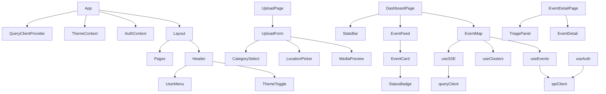

# Frontend Implementation Specification

## Overview

Civic incident monitoring frontend with two equal-priority user flows:
- **Citizens**: Report incidents, track status, earn badges
- **Operators**: Monitor map, triage events, view analytics

## Tech Stack

| Category | Choice | Rationale |
|----------|--------|-----------|
| Framework | React 18 + Vite | Already scaffolded |
| Styling | Tailwind CSS | User preference, fast iteration |
| State Management | TanStack Query v5 | Server state caching, SSE integration |
| UI State | React Context | Theme, auth only |
| Routing | React Router v6 | Already installed |
| Maps | Leaflet + react-leaflet | Already installed |
| HTTP | Fetch + custom client | Lightweight |

## Design System

### Color Palette

```css
/* Light Mode */
--bg-primary: #ffffff;
--bg-secondary: #f3f4f6;
--bg-tertiary: #e5e7eb;
--text-primary: #111827;
--text-secondary: #4b5563;
--text-muted: #9ca3af;
--border: #d1d5db;

/* Dark Mode */
--bg-primary: #111827;
--bg-secondary: #1f2937;
--bg-tertiary: #374151;
--text-primary: #f9fafb;
--text-secondary: #d1d5db;
--text-muted: #6b7280;
--border: #374151;

/* Semantic Colors (both modes) */
--status-new: #ef4444;        /* Red - urgent */
--status-verified: #f59e0b;   /* Amber - in progress */
--status-resolved: #10b981;   /* Emerald - done */
--status-rejected: #6b7280;   /* Gray - dismissed */
--accent: #3b82f6;            /* Blue - interactive */
```

### Event Category Icons

| Category | Icon | Color |
|----------|------|-------|
| fire | 🔥 | Red |
| accident | 🚗 | Amber |
| infrastructure | 🚧 | Orange |
| environment | 🌳 | Green |
| safety | ⚠️ | Yellow |
| other | 📍 | Blue |

### Typography

- **Headings**: font-semibold, tracking-tight
- **Body**: font-normal
- **Labels**: text-sm, text-secondary
- **Code/Data**: font-mono

## Component Architecture

```
src/
├── components/
│   ├── ui/                    # Reusable primitives
│   │   ├── Button.jsx         # Primary, secondary, danger variants
│   │   ├── Input.jsx          # Text, email, password, textarea
│   │   ├── Card.jsx           # Container with optional header
│   │   ├── Badge.jsx          # Status badges, category tags
│   │   ├── Modal.jsx          # Dialog overlay
│   │   ├── Spinner.jsx        # Loading indicator
│   │   ├── Skeleton.jsx       # Loading placeholder
│   │   └── ThemeToggle.jsx    # Sun/moon icon button
│   │
│   ├── layout/
│   │   ├── Header.jsx         # Logo, nav, user menu, theme toggle
│   │   ├── MobileNav.jsx      # Slide-out drawer for mobile
│   │   └── Layout.jsx         # Wraps pages with header
│   │
│   ├── auth/
│   │   ├── LoginForm.jsx      # Email + password fields
│   │   ├── RegisterForm.jsx   # Email + password + confirm
│   │   └── ProtectedRoute.jsx # Redirect if not authenticated
│   │
│   ├── map/
│   │   ├── EventMap.jsx       # Main Leaflet map container
│   │   ├── EventMarker.jsx    # Custom marker with category icon
│   │   ├── EventPopup.jsx     # Marker popup with event summary
│   │   ├── ClusterLayer.jsx   # Marker clustering for density
│   │   └── MapControls.jsx    # Filter toggles, locate button
│   │
│   ├── events/
│   │   ├── EventCard.jsx      # Compact event in feed list
│   │   ├── EventDetail.jsx    # Full event information
│   │   ├── EventFeed.jsx      # Scrollable event list
│   │   ├── EventFilters.jsx   # Status/category/date filters
│   │   ├── TriagePanel.jsx    # Operator action buttons
│   │   └── StatusBadge.jsx    # Colored status indicator
│   │
│   ├── upload/
│   │   ├── UploadForm.jsx     # Complete upload flow
│   │   ├── MediaPreview.jsx   # Photo/video thumbnail grid
│   │   ├── MediaCapture.jsx   # Camera/file input
│   │   ├── LocationPicker.jsx # Interactive map selector
│   │   └── CategorySelect.jsx # Dropdown with icons
│   │
│   └── gamification/
│       ├── BadgeCard.jsx      # Single badge display
│       ├── BadgeGrid.jsx      # All user badges
│       ├── ReputationBar.jsx  # XP progress bar
│       └── LeaderboardTable.jsx
│
├── hooks/
│   ├── useAuth.js             # Login, logout, register, user state
│   ├── useTheme.js            # Toggle dark/light, persist preference
│   ├── useSSE.js              # EventSource connection + query invalidation
│   ├── useEvents.js           # TanStack Query: list, detail, mutations
│   ├── useClusters.js         # TanStack Query: cluster data
│   ├── useStats.js            # TanStack Query: dashboard stats
│   ├── useGeolocation.js      # Browser geolocation API
│   └── useMediaUpload.js      # File upload with progress
│
├── context/
│   ├── AuthContext.jsx        # JWT tokens, user object, loading state
│   └── ThemeContext.jsx       # Current theme, toggle function
│
├── api/
│   ├── client.js              # Base fetch wrapper with auth headers
│   ├── auth.js                # /auth/* endpoints
│   ├── events.js              # /events/* endpoints
│   ├── clusters.js            # /clusters endpoint
│   └── stats.js               # /stats/* endpoints
│
├── pages/
│   ├── DashboardPage.jsx      # Map + feed + stats (main view)
│   ├── UploadPage.jsx         # Incident submission
│   ├── LoginPage.jsx          # Login form page
│   ├── RegisterPage.jsx       # Registration form page
│   ├── ProfilePage.jsx        # User stats, badges, my reports
│   ├── EventDetailPage.jsx    # Single event + triage panel
│   └── LeaderboardPage.jsx    # Top reporters
│
└── lib/
    ├── constants.js           # Categories, statuses, API URL
    ├── utils.js               # formatDate, classNames helper
    └── queryClient.js         # TanStack Query configuration
```

## Page Specifications

### Dashboard Page (/)

**Layout**: Split view on desktop, tabbed on mobile

```
┌─────────────────────────────────────────────────────────────┐
│  Header: [Logo] Dashboard | Upload | Leaderboard  [👤 Menu] │
├───────────────────────────────────┬─────────────────────────┤
│                                   │ ┌─ Filter Bar ────────┐ │
│                                   │ │ [All▾] [Status▾]    │ │
│        Interactive Map            │ └─────────────────────┘ │
│        (Leaflet + OSM)            │                         │
│                                   │ ┌─ Event Feed ────────┐ │
│    [Markers update via SSE]       │ │ 🔥 Fire @ Main St   │ │
│                                   │ │ 🚗 Accident...      │ │
│                                   │ │ 🚧 Pothole...       │ │
│                                   │ └─────────────────────┘ │
├───────────────────────────────────┴─────────────────────────┤
│  Stats Bar: [24 New] [12 In Progress] [156 Resolved Today]  │
└─────────────────────────────────────────────────────────────┘
```

**Features**:
- Real-time marker updates via SSE
- Click marker → popup with summary → link to detail
- Click feed item → center map on event
- Filter by status, category, date range
- Stats refresh on SSE events

### Upload Page (/upload)

**Layout**: Single column, mobile-optimized

```
┌──────────────────────────────────┐
│  ← Back        Report Incident   │
├──────────────────────────────────┤
│                                  │
│  ┌─ Media Upload ─────────────┐  │
│  │  [📷 Photo] [🎥 Video]     │  │
│  │                            │  │
│  │  ┌─────┐ ┌─────┐ ┌─────┐  │  │
│  │  │ img │ │ img │ │  +  │  │  │
│  │  └──×──┘ └──×──┘ └─────┘  │  │
│  └────────────────────────────┘  │
│                                  │
│  Category: [Infrastructure ▾]    │
│                                  │
│  Description:                    │
│  ┌────────────────────────────┐  │
│  │ Describe the incident...   │  │
│  └────────────────────────────┘  │
│                                  │
│  Location:                       │
│  ┌────────────────────────────┐  │
│  │     [Mini Map]             │  │
│  │        📍                  │  │
│  │                            │  │
│  │  [📍 Use My Location]      │  │
│  └────────────────────────────┘  │
│                                  │
│  ┌────────────────────────────┐  │
│  │      Submit Report         │  │
│  └────────────────────────────┘  │
│                                  │
└──────────────────────────────────┘
```

**Features**:
- Multi-file upload (photos + video)
- Live preview with remove button
- Drag-and-drop support
- GPS auto-fill with manual override
- Category dropdown with icons
- Form validation
- Upload progress indicator
- Success redirect to event detail

### Event Detail Page (/event/:id)

**Layout**: Full event view with triage panel for staff

```
┌──────────────────────────────────────────────────────────┐
│  ← Back to Map                              [Share 🔗]   │
├──────────────────────────────────────────────────────────┤
│                                                          │
│  🔥 Fire                                    [🔴 NEW]     │
│  Main Street & 5th Avenue                                │
│  Reported 5 minutes ago by @citizen123                   │
│                                                          │
│  ┌─ Media ────────────────────────────────────────────┐  │
│  │                                                    │  │
│  │              [Photo/Video Gallery]                 │  │
│  │                                                    │  │
│  └────────────────────────────────────────────────────┘  │
│                                                          │
│  Description:                                            │
│  "Smoke visible from building on corner. Fire           │
│   department not yet on scene."                          │
│                                                          │
│  📍 Location:                                            │
│  ┌────────────────────────────────────────────────────┐  │
│  │              [Static Map Preview]                  │  │
│  └────────────────────────────────────────────────────┘  │
│                                                          │
├──────────────────────────────────────────────────────────┤
│  STAFF ONLY - Triage Actions                             │
│  ┌──────────┐ ┌──────────┐ ┌──────────┐ ┌──────────┐    │
│  │ ✓ Verify │ │ ✗ Reject │ │ ✓ Resolve│ │ 🚨 Urgent│    │
│  └──────────┘ └──────────┘ └──────────┘ └──────────┘    │
│                                                          │
│  Notes:                                                  │
│  ┌────────────────────────────────────────────────────┐  │
│  │ Add internal notes...                              │  │
│  └────────────────────────────────────────────────────┘  │
└──────────────────────────────────────────────────────────┘
```

**Features**:
- Media gallery (swipe on mobile)
- Static map with marker
- Status history timeline
- Triage panel (staff only)
- Optimistic status updates
- Share button (copy link)

## Implementation Phases

### Phase 1: Foundation
**Goal**: Set up core infrastructure

- [ ] Install dependencies: `@tanstack/react-query`
- [ ] Create `lib/queryClient.js` with default options
- [ ] Create `ThemeContext` + `useTheme` hook
- [ ] Add CSS variables to `index.css`
- [ ] Configure Tailwind `darkMode: 'class'`
- [ ] Build UI primitives: Button, Input, Card, Spinner, Badge
- [ ] Create Layout + Header components
- [ ] Set up API client with base URL and error handling

**Files to create**:
```
src/lib/queryClient.js
src/lib/constants.js
src/context/ThemeContext.jsx
src/hooks/useTheme.js
src/components/ui/Button.jsx
src/components/ui/Input.jsx
src/components/ui/Card.jsx
src/components/ui/Spinner.jsx
src/components/ui/Badge.jsx
src/components/ui/ThemeToggle.jsx
src/components/layout/Header.jsx
src/components/layout/Layout.jsx
src/api/client.js
```

### Phase 2: Authentication
**Goal**: User login/register flow

- [ ] Create `AuthContext` with JWT management
- [ ] Implement `useAuth` hook
- [ ] Build LoginForm + RegisterForm
- [ ] Create ProtectedRoute component
- [ ] Add LoginPage + RegisterPage
- [ ] Add user menu to Header
- [ ] Persist tokens in localStorage
- [ ] Auto-refresh on 401

**Files to create**:
```
src/context/AuthContext.jsx
src/hooks/useAuth.js
src/api/auth.js
src/components/auth/LoginForm.jsx
src/components/auth/RegisterForm.jsx
src/components/auth/ProtectedRoute.jsx
src/pages/LoginPage.jsx
src/pages/RegisterPage.jsx
```

### Phase 3: Real-time Map (Priority #1)
**Goal**: Live updating map with SSE

- [ ] Refactor EventMap to use TanStack Query
- [ ] Create `useEvents` hook with query
- [ ] Create `useClusters` hook
- [ ] Build `useSSE` hook with EventSource
- [ ] Connect SSE to query invalidation
- [ ] Enhance EventMarker with category icons
- [ ] Add EventPopup component
- [ ] Build MapControls (filters, locate)
- [ ] Implement marker clustering

**Files to create/modify**:
```
src/hooks/useSSE.js
src/hooks/useEvents.js
src/hooks/useClusters.js
src/api/events.js
src/api/clusters.js
src/components/map/EventMap.jsx (refactor)
src/components/map/EventMarker.jsx (refactor)
src/components/map/EventPopup.jsx
src/components/map/ClusterLayer.jsx
src/components/map/MapControls.jsx
```

### Phase 4: Incident Upload (Priority #2)
**Goal**: Complete upload flow with preview

- [ ] Build MediaCapture (camera + file input)
- [ ] Create MediaPreview with thumbnails
- [ ] Implement LocationPicker with map
- [ ] Build CategorySelect dropdown
- [ ] Refactor UploadForm with all components
- [ ] Create upload mutation with progress
- [ ] Add form validation
- [ ] Success state + redirect

**Files to create/modify**:
```
src/hooks/useMediaUpload.js
src/components/upload/MediaCapture.jsx
src/components/upload/MediaPreview.jsx
src/components/upload/LocationPicker.jsx
src/components/upload/CategorySelect.jsx
src/components/upload/UploadForm.jsx (refactor)
src/pages/UploadPage.jsx (refactor)
```

### Phase 5: Triage Workflow (Priority #3)
**Goal**: Operator event management

- [ ] Create EventDetail component
- [ ] Build TriagePanel with action buttons
- [ ] Add status mutation with optimistic update
- [ ] Create EventDetailPage
- [ ] Enhance EventFeed with filters
- [ ] Build EventFilters component
- [ ] Add EventCard component
- [ ] Role-based UI visibility

**Files to create/modify**:
```
src/components/events/EventDetail.jsx
src/components/events/TriagePanel.jsx
src/components/events/EventCard.jsx
src/components/events/EventFeed.jsx (refactor)
src/components/events/EventFilters.jsx
src/components/events/StatusBadge.jsx
src/pages/EventDetailPage.jsx
src/pages/DashboardPage.jsx (refactor)
```

### Phase 6: Polish (If Time Permits)
**Goal**: Gamification + UX improvements

- [ ] ProfilePage with user stats
- [ ] BadgeGrid + BadgeCard components
- [ ] ReputationBar progress indicator
- [ ] LeaderboardPage + table
- [ ] Loading skeletons
- [ ] Mobile responsive pass
- [ ] Error boundaries
- [ ] Empty states

## API Integration

### Endpoints Used

```javascript
// Auth
POST /api/auth/register     { email, password }
POST /api/auth/token/pair   { email, password } → { access, refresh }
POST /api/auth/token/refresh { refresh } → { access }
GET  /api/auth/me           → { id, email, is_staff, profile }
PATCH /api/auth/me          { display_name, ... }

// Events
GET  /api/events            ?status=&category=&bbox=
POST /api/events/upload     FormData { media[], description, category, lat, lng }
GET  /api/events/:id        → Event detail
PATCH /api/events/:id/status { status, notes } (staff only)

// Clusters
GET  /api/clusters          ?bbox= → [{ id, lat, lng, event_count, category }]

// Stats
GET  /api/stats/summary     → { new, verified, resolved, total_today }

// Real-time
GET  /api/events/stream     SSE: { type, event }

// Gamification
GET  /api/auth/me/stats     → { reputation, badges[], report_count }
GET  /api/auth/leaderboard  → [{ user, reputation, badge_count }]
GET  /api/auth/badges       → [{ id, name, description, icon }]
```

### SSE Event Types

```javascript
{
  type: 'event_created',
  event: { id, category, status, lat, lng, ... }
}
{
  type: 'event_updated',
  event: { id, status, ... }
}
{
  type: 'cluster_updated',
  cluster: { id, event_count, ... }
}
```

### TanStack Query Keys

```javascript
['events', filters]           // Event list
['events', id]                // Single event
['clusters', bbox]            // Clusters in viewport
['stats', 'summary']          // Dashboard stats
['user', 'me']                // Current user
['user', 'stats']             // User gamification stats
['leaderboard']               // Top users
['badges']                    // All badge definitions
```

## Responsive Breakpoints

```javascript
// Tailwind defaults
sm: 640px   // Large phones
md: 768px   // Tablets
lg: 1024px  // Laptops
xl: 1280px  // Desktops
```

### Layout Behavior

| Breakpoint | Map/Feed | Navigation |
|------------|----------|------------|
| < md | Tabbed (map OR feed) | Bottom nav or hamburger |
| ≥ md | Side by side (70/30) | Top header |
| ≥ lg | Side by side (65/35) | Top header with expanded nav |

## File Dependencies



## Success Criteria

### Phase 3 Complete (Real-time Map)
- [ ] Map displays events from API
- [ ] Markers show correct category icons
- [ ] Click marker shows popup with details
- [ ] New events appear without refresh (SSE)
- [ ] Map clusters dense areas

### Phase 4 Complete (Upload)
- [ ] Can capture photo/video from device
- [ ] Preview shows selected media
- [ ] Can remove media from preview
- [ ] Location auto-fills from GPS
- [ ] Can manually adjust location on map
- [ ] Form validates required fields
- [ ] Upload shows progress
- [ ] Redirects to event on success

### Phase 5 Complete (Triage)
- [ ] Staff see triage panel on event detail
- [ ] Can change status (verify/reject/resolve)
- [ ] Status change reflects immediately (optimistic)
- [ ] Feed can filter by status
- [ ] Non-staff don't see triage controls
